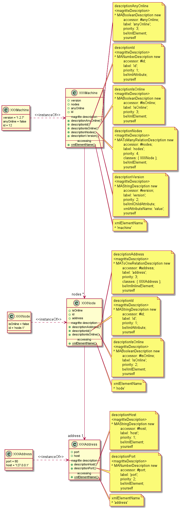

# XML Magritte Generator
[](https://travis-ci.org/peteruhnak/xml-magritte-generator) []()

With this library you can take a "nice" XML and generate Pharo class hierarchy with Magritte Descriptions for each variable.
I use [Magritte XML Bindings](https://github.com/magritte-metamodel/XML-Bindings/), which gives the hierarchy free XML import/export.

The generator will try to guess basic types (Boolean, Integer, Float, String), and the relationship between the parent and child elements (attribute, collection (oneToMany), reference (oneToOne)).

For example if you feed it "nice" XMLs like this one

```xml
<machine id="12">
	<version value="1.2.7" />
	<anyOnline>false</anyOnline>
	<nodes>
		<node id="node-1">
			<isOnline>false</isOnline>
			<address>
				<host>127.0.0.1</host>
				<port>80</port>
			</address>
		</node>
	</nodes>
</machine>
```

it will exhaust class hierarchy and populate it with the content



## Unsupported

Since it is mostly magic, it doesn't always work, for example in the scenarios below.
Note that it may fail in a variety of unforeseen circumstances, so feel free to [open an issue](https://github.com/peteruhnak/xml-magritte-generator/issues).

**Namespaces / namespaced names:**

Because `copyReplaceAll: ':' with: '_'` is too much work.

```xml
<xmi:element />
<element xml:attr="value" />
```

**Elements with non-uniform repeating children:**

Because I use the `container` element as variable name to hold `child` references.

This is ok:

```xml
<root>
  <container>
    <child />
    <child />
  </container>
</root>
```

This is not ok:

```xml
<root>
  <container>
    <child />
    <child />
    <otherThing />
  </container>
</root>
```

## Usage

Use the generator along those lines:

*`dom` is an instance of `XMLDocument`*

### Generator

```st
gen := XOGStructureGenerator new.
"optional attributes, they have their default values"
gen packageName: 'MachineGenerated'.
gen classPrefix: 'XXX'. "to avoid name conflicts"
gen rootClassName: 'MXObject'. "a class from which all the classes will inherit"

"run the generator; this will NOT create the code yet"
gen processDocument: dom.

"get RBNamespace instance with `gen rbModel`, and open changes browser on it"
(ChangesBrowser changes: gen rbModel changes changes) open.
```

**NOTE** that all the generated classes must contain this method:

```
descriptionContainer
	<magritteContainer>
	^ super descriptionContainer
		xmlElementName: self class xmlElementName;
		yourself
```

you can either:

* use `'MXObject'` which implements it
* add the method to your own root class
* use `TMXDescription` trait
* do what you want


### XML → Object

```st
obj := XXXClassForRootElement new magritteDescription fromXmlNode: dom root.
```

### Object → XML

```st
obj magritteDescription toXmlDocument: obj.
```

### Inference

The inferencers are messy and hacky, but not too long. You can inspect these invocations three to see what they produce:

```st
XOGValueTypeInference new inferDocument: dom.
XOGTypeClassification new classificationFor: dom.
XOGTypeClassification new hierarchyFor: dom.
```

## Installation

```st
Metacello new
    baseline: #XMLMAGenerator;
    repository: 'github://peteruhnak/xml-magritte-generator/repository';
    load
```

This will also pull some dependencies:

```st
BaselineOfXmlMaGenerator project latestVersion projects collect: [ :each | each name -> each versionString ]
 "an OrderedCollection('XMLParser'->#stable 'XPath'->#stable 'Magritte'->#stable)"
```
